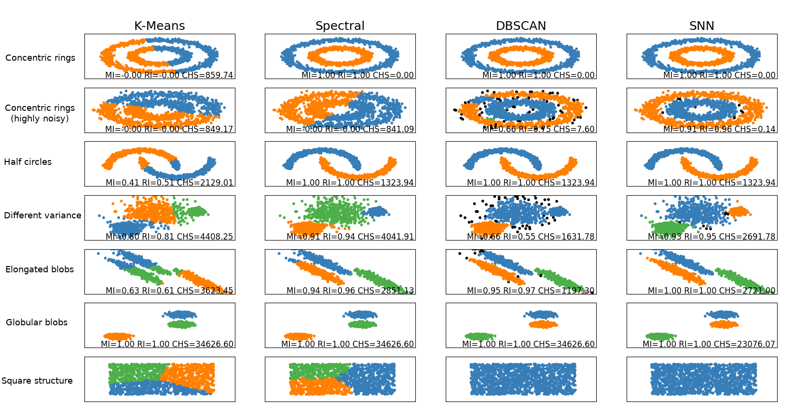

# Shared Nearest Neighbor Clustering Algorithm: Implementation and Evaluation

The Shared Nearest Neighbor clustering algorithm [1], also known as SNN, is an extension of DBSCAN that aims to overcome its limitation of not being able to correctly create clusters of different densities. This work provides a Python 3 implementation for SNN following the conventions of the scikit-learn library, and compares its results to multiple datasets with other, more traditional clustering methods.

[1] Ertöz, L., Steinbach, M., & Kumar, V. (2003, May). Finding clusters of different sizes, shapes, and densities in noisy, high dimensional data. In Proceedings of the 2003 SIAM international conference on data mining (pp. 47-58). Society for Industrial and Applied Mathematics.

| | |
|-|-|
| **Author** | Albert Espín |
| **Date**  | April 2019  |
| **Code icense**  | MIT |
| **Report license**  | Creative Commons Attribution, Non-Commercial, Non-Derivative |

